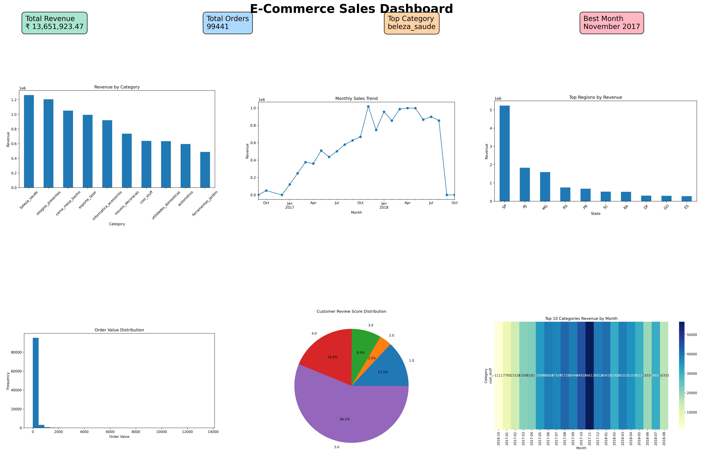

# E-Commerce Sales Analysis

## Project Overview

This project analyzes the Olist Brazilian E-Commerce dataset using Python and Excel. The objective was to evaluate sales performance, identify trends, compare product categories and regions, build a management dashboard, and provide business recommendations.

---

## Tools Used

- Python
- Pandas
- Matplotlib
- Seaborn
- Excel
- Google Colab

---

## Dashboard

Below is the dashboard created for this project.

---

# Business Insights Report

## Introduction

This report presents the analysis of the Olist Brazilian E-Commerce dataset. The objective was to evaluate sales performance, identify trends, compare product categories and regions, and provide actionable business recommendations based on the findings.

---

## Insight 1 – Highest Revenue Category

**Finding (Revenue by Category Chart)**

The **Beleza Saude** category generated the highest revenue among all product categories.

**Recommendation**

Increase inventory, promotional campaigns, and cross-selling opportunities for this category to maximize revenue.

---

## Insight 2 – Peak Sales Month

**Finding (Monthly Sales Trend Chart)**

The highest sales were recorded in **November 2017**, indicating strong seasonal demand.

**Recommendation**

Plan marketing campaigns and stock management before peak shopping months to capture higher sales.

---

## Insight 3 – Best Performing Region

**Finding (Regional Sales Chart)**

The **SP** region contributed the highest sales revenue.

**Recommendation**

Strengthen logistics, warehouse capacity, and customer engagement in this high-performing region while developing marketing strategies for lower-performing regions.

---

## Insight 4 – Order Value Distribution

**Finding (Order Value Histogram)**

Most orders fall within a moderate price range, with relatively few high-value purchases.

**Recommendation**

Introduce bundle offers, premium products, and upselling strategies to increase the average order value.

---

## Insight 5 – Customer Reviews

**Finding (Customer Review Distribution Chart)**

Most customers gave **4-star and 5-star ratings**, indicating generally positive customer satisfaction.

**Recommendation**

Maintain product quality and customer service standards while investigating the reasons behind low-rated reviews to improve the customer experience.

---

## Conclusion

The analysis shows that the business performs strongly in specific product categories and regions, with noticeable seasonal sales patterns and positive customer feedback. Implementing the recommended strategies can help increase revenue, improve customer satisfaction, and support future business growth.

---
## Most Surprising Finding
The most surprising finding was that the Beleza Saude category generated the highest revenue while the majority of customers still gave 4-star and 5-star reviews. Additionally, sales peaked sharply in November 2017, highlighting the impact of seasonal demand. These findings emphasize the importance of inventory planning and targeted marketing during peak periods.

## Project Files

- `analysis.ipynb`
- `Cleaned_Olist_Data.xlsx`
- `Dashboard.png`
- `Business_Insights_Report.docx`
